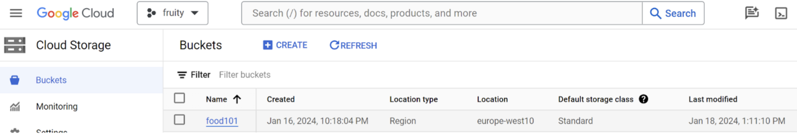

# Exam template for 02476 Machine Learning Operations

This is the report template for the exam. Please only remove the text formatted as with three dashes in front and behind
like:

```--- question 1 fill here ---```

where you instead should add your answers. Any other changes may have unwanted consequences when your report is auto
generated in the end of the course. For questions where you are asked to include images, start by adding the image to
the `figures` subfolder (please only use `.png`, `.jpg` or `.jpeg`) and then add the following code in your answer:

```markdown

```

In addition to this markdown file, we also provide the `report.py` script that provides two utility functions:

Running:

```bash
python report.py html
```

will generate an `.html` page of your report. After deadline for answering this template, we will autoscrape
everything in this `reports` folder and then use this utility to generate an `.html` page that will be your serve
as your final handin.

Running

```bash
python report.py check
```

will check your answers in this template against the constrains listed for each question e.g. is your answer too
short, too long, have you included an image when asked to.

For both functions to work it is important that you do not rename anything. The script have two dependencies that can
be installed with `pip install click markdown`.

## Overall project checklist

The checklist is *exhaustic* which means that it includes everything that you could possible do on the project in
relation the curricilum in this course. Therefore, we do not expect at all that you have checked of all boxes at the
end of the project.

### Week 1

* [X] Create a git repository
* [X] Make sure that all team members have write access to the github repository
* [X] Create a dedicated environment for you project to keep track of your packages
* [X] Create the initial file structure using cookiecutter
* [ ] Fill out the `make_dataset.py` file such that it downloads whatever data you need and
* [X] Add a model file and a training script and get that running
* [X] Remember to fill out the `requirements.txt` file with whatever dependencies that you are using
* [X] Remember to comply with good coding practices (`pep8`) while doing the project
* [X] Do a bit of code typing and remember to document essential parts of your code
* [X] Setup version control for your data or part of your data
* [X] Construct one or multiple docker files for your code
* [X] Build the docker files locally and make sure they work as intended
* [X] Write one or multiple configurations files for your experiments
* [X] Used Hydra to load the configurations and manage your hyperparameters
* [ ] When you have something that works somewhat, remember at some point to to some profiling and see if
      you can optimize your code
* [X] Use Weights & Biases to log training progress and other important metrics/artifacts in your code. Additionally,
      consider running a hyperparameter optimization sweep.
* [X] Use Pytorch-lightning (if applicable) to reduce the amount of boilerplate in your code

### Week 2

* [X] Write unit tests related to the data part of your code
* [X] Write unit tests related to model construction and or model training
* [X] Calculate the coverage.
* [X] Get some continuous integration running on the github repository
* [X] Create a data storage in GCP Bucket for you data and preferable link this with your data version control setup
* [X] Create a trigger workflow for automatically building your docker images
* [X] Get your model training in GCP using either the Engine or Vertex AI
* [X] Create a FastAPI application that can do inference using your model
* [ ] If applicable, consider deploying the model locally using torchserve
* [X] Deploy your model in GCP using either Functions or Run as the backend

### Week 3

* [ ] Check how robust your model is towards data drifting
* [ ] Setup monitoring for the system telemetry of your deployed model
* [ ] Setup monitoring for the performance of your deployed model
* [X] If applicable, play around with distributed data loading
* [X] If applicable, play around with distributed model training
* [X] Play around with quantization, compilation and pruning for you trained models to increase inference speed

### Additional

* [X] Revisit your initial project description. Did the project turn out as you wanted?
* [X] Make sure all group members have a understanding about all parts of the project
* [X] Uploaded all your code to github

## Group information

### Question 1
> **Enter the group number you signed up on <learn.inside.dtu.dk>**
>
> Answer:

14

### Question 2
> **Enter the study number for each member in the group**
>
> Example:
>
> *sXXXXXX, sXXXXXX, sXXXXXX*
>
> Answer:

s183904, s183918, s183921, s183931

### Question 3
> **What framework did you choose to work with and did it help you complete the project?**
>
> Answer length: 100-200 words.
>
> Example:
> *We used the third-party framework ... in our project. We used functionality ... and functionality ... from the*
> *package to do ... and ... in our project*.
>
> Answer:

We used PyTorch Lightning as the general framework in order to reduce the amount of boilerplate code and get started on the interesting coding challenges. We chose the model from the list of pre-trained TIMM (pytorch image models) models that performed best based on initial testing on the foods_101 classification task presented in this project. To do version control, git and dvc were used. At the beginning of the project, cookiecutter helped up set up the project, after which github actions (with pytest and ruff), unit tests and precommits were used to ensure the expected and bug-free functionality from our programming. We tracked our runs using weights and biases and hydra config files and we used GCP to run our project in the cloud.

## Coding environment

> In the following section we are interested in learning more about you local development environment.

### Question 4

> **Explain how you managed dependencies in your project? Explain the process a new team member would have to go**
> **through to get an exact copy of your environment.**
>
> Answer length: 100-200 words
>
> Example:
> *We used ... for managing our dependencies. The list of dependencies was auto-generated using ... . To get a*
> *complete copy of our development environment, one would have to run the following commands*
>
> Answer:

We used pip for managing dependencies and throughout the work on the project, pipreqs was used to get the requirements for the development environment. If a new person were to join the project, they could get a copy of the development environment by running the commands:
```bash
git clone https://github.com/wdmdev/fruity.git

cd fruity

dvc pull

make create_environment
conda activate fruity

make requirements

make dvcfood
```

What these commands accomplish is first to clone the repository locally. Afterwards, the newest version of the data is downloaded, the conda virtual environment is created and activated, and lastly  all files from the requirements.txt file generated from pipreqs are installed on the virtual environment.


### Question 5

> **We expect that you initialized your project using the cookiecutter template. Explain the overall structure of your**
> **code. Did you fill out every folder or only a subset?**
>
> Answer length: 100-200 words
>
> Example:
> *From the cookiecutter template we have filled out the ... , ... and ... folder. We have removed the ... folder*
> *because we did not use any ... in our project. We have added an ... folder that contains ... for running our*
> *experiments.*
> Answer:

From the cookiecutter template we have filled out the tests, dockerfiles, and .github folders. Also we filled out the models, train_model.py, predict_model.py, and data (just a bit of renaming). Although we changed the layout to a src-layout based on recommendations from the 'Python Packaging user Guide' e.g. prevent accidental usage of the in-development copy of the code.  
We have added a conf folder that contains Hydra configs for running our experiments. 
We have added an app folder that contains the fastapi code for serving an inference model endpoint on GC Run and a frontend folder containing a streamlit frontend that calls the backend api.

### Question 6

> **Did you implement any rules for code quality and format? Additionally, explain with your own words why these**
> **concepts matters in larger projects.**
>
> Answer length: 50-100 words.
>
> Answer:

To ensure the best code quality and format, we used ruff in github actions to adhere as best as possible to the pep8 style guide and to check for static typing using mypy. We also added typing hints with the typing python package. This matters in large projects, as code in such case is made as readable as possible (people read code more often than they write it) and errors are avoided to a degree where programmers know what types they should expect as inputs and outputs to their functions.

## Version control

> In the following section we are interested in how version control was used in your project during development to
> corporate and increase the quality of your code.

### Question 7

> **How many tests did you implement and what are they testing in your code?**
>
> Answer length: 50-100 words.
>
> Example:
> *In total we have implemented X tests. Primarily we are testing ... and ... as these the most critical parts of our*
> *application but also ... .*
>
> Answer:

We have implemented 4 tests, 2 for data and 2 for the model, though these each contain a lot of assert-checks each. These would ideally be split further up into more separate test, which would make it easier to identify the root of a problem due to the failed test, but in our case this worked fine. 

### Question 8

> **What is the total code coverage (in percentage) of your code? If you code had an code coverage of 100% (or close**
> **to), would you still trust it to be error free? Explain you reasoning.**
>
> Answer length: 100-200 words.
>
> Example:
> *The total code coverage of code is X%, which includes all our source code. We are far from 100% coverage of our **
> *code and even if we were then...*
>
> Answer:

The total coverage of our source code is 40% for the model and 100% for the data. This is far from 100% general coverage, but it does however test the most important parts of the code which are model, training and data parts.  
If we were at 100%, we would firstly be testing a bunch of code that does not necessarily have any critical impact on the functionality of the project. Secondly, 100% coverage does not equal 100% confidence in error-less performance, as the effectiveness of testing depends on the quality of the test cases, ie. high code coverage doesn't mean the tests are necessarily comprehensive. Even though we were to cover 100% of our code, we would still risk encountering problems caused by outside systems, as these projects are complex and dynamic in nature due to utilizing many services and so on. Lastly, tests can simply be written badly and create problems due to basic human error, even though they cover 100%.


### Question 9

> **Did you workflow include using branches and pull requests? If yes, explain how. If not, explain how branches and**
> **pull request can help improve version control.**
>
> Answer length: 100-200 words.
>
> Example:
> *We made use of both branches and PRs in our project. In our group, each member had an branch that they worked on in*
> *addition to the main branch. To merge code we ...*
>
> Answer:

We made use of both branches and PRs in our project. Our git repo was set up with a protected main branch, meaning changes had to be committed and made as PRs from separate branches. To merge code from PRs, we set up the repo such that another member had to review the PR before the merge could be made. A (mostly verbal) convention was set up such that branches named feature/BRANCH_NAME were considered new features while bug/BRANCH_NAME were considered hotfixes and corrections. Furthermore, labels were used on the git issues such that the important tasks could be discovered at a quick glance.  
Further, the pytest unittests were run using Github Actions, whenever a PR was made, ensuring that the proposed changes at least passed tests and hence did not break functionality on the main branch. The Github Actions also run Ruff to check formatting of the committed code and mypy static type checking. We also added the Ruff format check and mypy static type check to pre-commit to ensure no commits not following our desired style guides. Further more we used github issues for tasks and created branches and PRs based on these.


### Question 10

> **Did you use DVC for managing data in your project? If yes, then how did it improve your project to have version**
> **control of your data. If no, explain a case where it would be beneficial to have version control of your data.**
>
> Answer length: 100-200 words.
>
> Example:
> *We did make use of DVC in the following way: ... . In the end it helped us in ... for controlling ... part of our*
> *pipeline*
>
> Answer:

We did make use of DVC in the following way: We used DVC for managing the data for the project, which improved our project in the sense that it is now easier for the user to get access to our data without the data being available on github. We are able to keep track of old versions of the data as well as rerun old models with the data that were used at that point in time. This was especially helpful because we were able to switch the type of data we were training on midway through without losing important history of the runs of the project beforehand.

### Question 11

> **Discuss you continues integration setup. What kind of CI are you running (unittesting, linting, etc.)? Do you test**
> **multiple operating systems, python version etc. Do you make use of caching? Feel free to insert a link to one of**
> **your github actions workflow.**
>
> Answer length: 200-300 words.
>
> Example:
> *We have organized our CI into 3 separate files: one for doing ..., one for running ... testing and one for running*
> *... . In particular for our ..., we used ... .An example of a triggered workflow can be seen here: <weblink>*
>
> Answer:

We used unit testing by implementing Pytest tests for the model and data.  Linting and formatting rules were defined using Ruff, which was also implemented in the pre-commit for each team member, such that formatting issues could be immediately amended.
We did not test multiple operating systems, however we acknowledge that doing so would enable deployment on local machines easier and would open up the project to more users. Using 
We also did not test multiple Python versions, since we enforce the use of Python 3.10.9 in our Fruity conda virtual machine. In that sense, running the code using different versions of python would be a mistake, since functionality from this version is used.
We avoided caching, as this was deemed to be non-critical to the project. Had the github actions checks taken longer to run, caching could have been implemented to speed up this aspect of development.
We organized our github actions into just one tests.yaml file for github actions, which uses pytest to test all functionality in the code, tests the formatting and formats the code with ruff and checks the coverage of the tests using the coverage package. This file can be accessed through the following link: https://github.com/wdmdev/fruity/blob/main/.github/workflows/tests.yaml


## Running code and tracking experiments

> In the following section we are interested in learning more about the experimental setup for running your code and
> especially the reproducibility of your experiments.

### Question 12

> **How did you configure experiments? Did you make use of config files? Explain with coding examples of how you would**
> **run a experiment.**
>
> Answer length: 50-100 words.
>
> Example:
> *We used a simple argparser, that worked in the following way: python my_script.py --lr 1e-3 --batch_size 25*
>
> Answer:

We used Hydra configs. Here we defined a hierarchical structure where we defined config files for desired classes and used hydra to instantiate the objects. For experiments we used an experiment folder such that the default hydra configs could be overwritten with a new experiment.yaml e.g. by running `python train.py experiment=experiment1`.

### Question 13

> **Reproducibility of experiments are important. Related to the last question, how did you secure that no information**
> **is lost when running experiments and that your experiments are reproducible?**
>
> Answer length: 100-200 words.
>
> Example:
> *We made use of config files. Whenever an experiment is run the following happens: ... . To reproduce an experiment*
> *one would have to do ...*
>
> Answer:

As explained in the answer to the last question, the experiments are tracked in the experiments folder of the project or the individual config files can be edited if the default values should be changed. In both cases, weights and biases is used to keep track of the config files and tracks these for each of the runs and sweeps that are performed. If seeds are then also set for each of the runs and the user ensures that he is using the correct git commit and dvc data instance, using the same config file should yield exactly the same results from the model when running a second time.

### Question 14

> **Upload 1 to 3 screenshots that show the experiments that you have done in W&B (or another experiment tracking**
> **service of your choice). This may include loss graphs, logged images, hyperparameter sweeps etc. You can take**
> **inspiration from [this figure](figures/wandb.png). Explain what metrics you are tracking and why they are**
> **important.**
>
> Answer length: 200-300 words + 1 to 3 screenshots.
>
> Example:
> *As seen in the first image when have tracked ... and ... which both inform us about ... in our experiments.*
> *As seen in the second image we are also tracking ... and ...*
>
> Answer:

The first and second images show the most valuable sweep from our experimentation with models. We tried a number of different pre-trained model architectures and also tested ranges for the batch size, weight decay and learning rate. We learned that batch size and weight decay has the highest importance in terms of increasing validation accuracy.

Based on the image below, we also noted that larger models lead to a better performance in general, which probably meant that the chosen models were not complex enough to learn meaningful representations of the data. We also learned that well-performing models had high batch size, high learning rate and low weight decay.

The last run shows the performance of a much larger model using parameters close to those suggested by the previous hyperparamter sweep. This larger model and the well-fitted hyperparameters lead to about 76% validation and test accuracy on the 101-class problem. This means that we were successful in getting a model to perform way better than the baseline on such a dataset using weights and biases.

Had the project had a larger focus on getting the best possible accuracy, we would have run more sweeps for much larger and varying models after noticing the lack of performance from the models first tested in the sweep. This new sweep could indicate more fitting hyperparameters for these larger models and maybe even the ideal model size for this specific problem. Since we had many other tools to get working for this project, we had to accept the last run as the best we were able to get within the time given in this course.


### Question 15

> **Docker is an important tool for creating containerized applications. Explain how you used docker in your**
> **experiments? Include how you would run your docker images and include a link to one of your docker files.**
>
> Answer length: 100-200 words.
>
> Example:
> *For our project we developed several images: one for training, inference and deployment. For example to run the*
> *training docker image: `docker run trainer:latest lr=1e-3 batch_size=64`. Link to docker file: <weblink>*
>
> Answer:

For inference we developed two docker images, which means one for running on a local machine and one for the GC Run deployment. The main difference between the two images hence being that the local image loads the model from a local folder and the GC Run image being integrated with the GC Storage python api client to load the model into the docker container when the fastapi service is running.
To run the api docker image locally one can use the command:
```bash
make run_local_api_image
```
This is equivalent to running:
```bash
docker build -t local_fruity_api -f dockerfiles/local.api.dockerfile .
docker run -e GOOGLE_APPLICATION_CREDENTIALS=/tmp/gcloud/fruity-api-credentials.json \
				-v ~/.config/gcloud:/tmp/gcloud \
				-p 80:80 local_fruity_api
```
We are aware that the need for a credentials file does not make it possible for everyone to access the api. However we deemed it necessary to avoid misuse of the GC resources.


### Question 16

> **When running into bugs while trying to run your experiments, how did you perform debugging? Additionally, did you**
> **try to profile your code or do you think it is already perfect?**
>
> Answer length: 100-200 words.
>
> Example:
> *Debugging method was dependent on group member. Some just used ... and others used ... . We did a single profiling*
> *run of our main code at some point that showed ...*
>
> Answer:

Most of our group members used the built-in python debugger in vscode when running into issues. When the debugger was not useful enough and some quick print statements were not sufficient in explaining the error, chat gpt was sometimes useful. This was especially the case when we had to write code in frameworks that we were not very familiar with like difficult fastapi and yaml file configurations.
In terms of profiling, we sadly did not get the chance to run the cProfile, torch profiler, line_profiler or kernprof profiling methods in this project work. We had too many more important focus points to get into profiling, although we acknowledge that profiling had been helpful, especially when our GCP compute engine VM started running rather slowly after a branch merge. Since we did not need fast run-time in our circumstances, we chose not to focus on fixing this issue.

## Working in the cloud

> In the following section we would like to know more about your experience when developing in the cloud.

### Question 17

> **List all the GCP services that you made use of in your project and shortly explain what each service does?**
>
> Answer length: 50-200 words.
>
> Example:
> *We used the following two services: Engine and Bucket. Engine is used for... and Bucket is used for...*
>
> Answer:

We used the following 3 services:
* Google Cloud Storage (Bucket): For saving data and models to the cloud.
* Google Cloud Build (kind of part of GC Run): For continuous deployment of dockerized programs e.g. FastAPI endpoint. Triggered by file changes in github repo.
* Google Cloud Run: For serving dockerized applications and managing them with monitoring and cloud logging.

### Question 18

> **The backbone of GCP is the Compute engine. Explained how you made use of this service and what type of VMs**
> **you used?**
>
> Answer length: 100-200 words.
>
> Example:
> *We used the compute engine to run our ... . We used instances with the following hardware: ... and we started the*
> *using a custom container: ...*
>
> Answer:

All model training was performed on a google cloud compute engine VM equipped with a 4 core cpu, 16gb ram and a tesla t4 GPU. The training was performed by cloning the repo onto the vm, downloading data onto the VM from a bucket using DVC, created and installing requirements on the conda environment with the necessary python version, then conducting the experiment(s) according to a hydra config or wandb sweep.  After a satisfactory model performance had been achieved and the best hyperparameters had been chosen, a standard wandb run was run and the best model was uploaded (manually sadly) to a bucket which could be accessed by the fast API backend etc. 

### Question 19

> **Insert 1-2 images of your GCP bucket, such that we can see what data you have stored in it.**
> **You can take inspiration from [this figure](figures/bucket.png).**
>
> Answer:


with the DVC indexed content:


### Question 20

> **Upload one image of your GCP container registry, such that we can see the different images that you have stored.**
> **You can take inspiration from [this figure](figures/registry.png).**
>
> Answer:

We used the Artifact Registry recommended by the GC Platform.


### Question 21

> **Upload one image of your GCP cloud build history, so we can see the history of the images that have been build in**
> **your project. You can take inspiration from [this figure](figures/build.png).**
>
> Answer:


### Question 22

> **Did you manage to deploy your model, either in locally or cloud? If not, describe why. If yes, describe how and**
> **preferably how you invoke your deployed service?**
>
> Answer length: 100-200 words.
>
> Example:
> *For deployment we wrapped our model into application using ... . We first tried locally serving the model, which*
> *worked. Afterwards we deployed it in the cloud, using ... . To invoke the service an user would call*
> *`curl -X POST -F "file=@file.json"<weburl>`*
>
> Answer:

For deployment we wrapped our model into an application using FastAPI. We first tried locally serving the model, which worked. Then we build a docker container and ran that locally to ensure it worked and that the correct ports were exposed. Afterwards we deployed it in the cloud, using Google Cloud Run and Google Cloud Build. We did this by connecting the GC Run service and GC Build service to our Github Repo through the Console. Here we had to make some configurations to the build process to set the correct port for the container, the correct context for the container (it by default starts in the folder where the dockerfile is), and to define the files to listen on for changes in the github repo for when to rebuild and deploy. We also added code in the api, such that the model is loaded from a bucket in Google Cloud storage when the api is started. The service is publicly available and the Swagger docs can be seen on: https://fruity-backend-fyut4y5n7a-ey.a.run.app/. We have a single image and batch image classification endpoint.

### Question 23

> **Did you manage to implement monitoring of your deployed model? If yes, explain how it works. If not, explain how**
> **monitoring would help the longevity of your application.**
>
> Answer length: 100-200 words.
>
> Example:
> *We did not manage to implement monitoring. We would like to have monitoring implemented such that over time we could*
> *measure ... and ... that would inform us about this ... behaviour of our application.*
>
> Answer:

No, we did not implement monitoring. However, had we done so, monitoring would enable us to continuously maintain an overview of model performance and functionality as it is in production. With monitoring, we amongst other things seek to ensure continuous good performance by detecting data drift, ie. change in input data distribution, which can greatly hamper performance. By detecting data drift, we can retrain our model or re-optimize to accommodate the new data distribution. We are also seeking to avoid downtime by detecting potential/occurring anomalies that can break the model. Using monitoring can also alert us about abnormal activity, which can in some cases be caused by malicious usage/security breaches. 

### Question 24

> **How many credits did you end up using during the project and what service was most expensive?**
>
> Answer length: 25-100 words.
>
> Example:
> *Group member 1 used ..., Group member 2 used ..., in total ... credits was spend during development. The service*
> *costing the most was ... due to ...*
>
> Answer:

Across all our accounts we spend about 413ddks worth of credits. The most expensive service was without competition the VM equipped with a GPU used for training. The model api on Google Cloud Run together with a bucket on GC storage ended up costing 1 kr. 

## Overall discussion of project

> In the following section we would like you to think about the general structure of your project.

### Question 25

> **Include a figure that describes the overall architecture of your system and what services that you make use of.**
> **You can take inspiration from [this figure](figures/overview.png). Additionally in your own words, explain the**
> **overall steps in figure.**
>
> Answer length: 200-400 words
>
> Example:
>
> *The starting point of the diagram is our local setup, where we integrated ... and ... and ... into our code.*
> *Whenever we commit code and puch to github, it auto triggers ... and ... . From there the diagram shows ...*
>
> Answer:


This diagram outlines our MLOps project setup, detailing the workflow from development to deployment for a machine learning application. Here's a breakdown of the workflow shown in the diagram.
1. Local Development:  
The process starts with a developer working on their local machine. They can use Hydra configs experimentation (train/val/testing) and they can track their experiments using W&B (Weights & Biases).
2. Code Quality and Version Control:  
Before the code is committed and pushed to a repository, code quality checks are done with Ruff (formatting/linting) and pre-commit hooks are applied to enforce the standards.  
The code is then committed and pushed to GitHub, a version control platform.
3. Continuous Integration and Delivery (CI/CD):  
GitHub Actions are used to automate workflows, such as running tests, checking code coverage, and ensuring the code adheres to style guidelines and static type checking (mypy).  
When the code is pushed to GitHub with a change to specific docker and/or code files, it triggers a build in Google Cloud Build,  that executes the build on Google Cloud Platform (GCP).
4. Compute Engine:  
The Compute Engine is where the training of the machine learning models takes place, using computational resources in VMs provided by Google Cloud.
5. Model and Data Versioning:  
DVC (Data Version Control) is used for versioning the data.  
The models and training data are stored in buckets on Google Cloud Storage.
6. Model Deployment:  
The trained model is deployed using FastAPI, which is then hosted on Google Cloud Run.  
Streamlit, which is a framework for quickly creating data applications, is used to create an MVP for a user interface for interacting with the model inference API endpoint.
7. End-User Interaction:  
The user can clone the source code from GitHub and run the application locally on their machine, possibly interacting with the deployed model through the Streamlit interface or directly with the API which can be served locally directly on the machine hardware or using docker.


### Question 26

> **Discuss the overall struggles of the project. Where did you spend most time and what did you do to overcome these**
> **challenges?**
>
> Answer length: 200-400 words.
>
> Example:
> *The biggest challenges in the project was using ... tool to do ... . The reason for this was ...*
>
> Answer:

- One big issue we had was deploying the model inference api. We wanted to connect a GC Storage bucket to the GC Run container. We did not realize that the GC Builder uses another service agent than the developer service agent. Therefore we got a lot of error due to lack of permissions. To get around this we ended up not loading the model from GCS during the container build and instead load it in the code during runtime where the developer service agent permissions are used.
- DVC caused issues because it did not work well for a large number of very small files. We also ran into runtime issues on the virtual machine, since it suddenly lost a lot of runtime. We had trouble finding the reason for the reduction in speed and we generally lost a lot of productivity for this reason.
- While we had gotten to know the different methods throughout the course sessions and had a small amount of familiarity with how to get stuff to work in isolation, most of the modules on getting stuff to work together were allocated as optional modules. This meant that we had a lot of trouble getting everything we learned in this course to work together, since many methods are not straight-forward to get to talk to each other. One example of this was getting hydra to work in combination with weights and biases and pytorch lightning. It turned out to be true for us that higher levels of abstraction and less boilerplate leads to scrips that are much more difficult to debug and generally find errors in, since nothing happens explicitly and most of the errors were caused by code that we did not write. While we got most of the desired functionality working in the end, we had trouble getting there. Another example was getting cuda to work in the requirements file on GCP. This was difficult because the cuda version in the requirements folder had to match the version on the VM.


### Question 27

> **State the individual contributions of each team member. This is required information from DTU, because we need to**
> **make sure all members contributed actively to the project**
>
> Answer length: 50-200 words.
>
> Example:
> *Student sXXXXXX was in charge of developing of setting up the initial cookie cutter project and developing of the*
> *docker containers for training our applications.*
> *Student sXXXXXX was in charge of training our models in the cloud and deploying them afterwards.*
> *All members contributed to code by...*
>
> Answer:

Student s183904 was in charge of hyperparameter optimization, weights and biases, ruff and some parts of the model training.  
Student s183918 was in charge of tests and making the front-end of the streamlit test app.  
Student s183921 was in charge of setting up the initial project using cookiecutter, pre-commit, branch protection etc. and implementing and deploying the fastapi inference point on GC Run.  
Student s183931 was in charge of most of the GCP functionality and the model training.  
While these are the distributions of what the students have been most engaged with, each member of the team contributed to the project equally.
